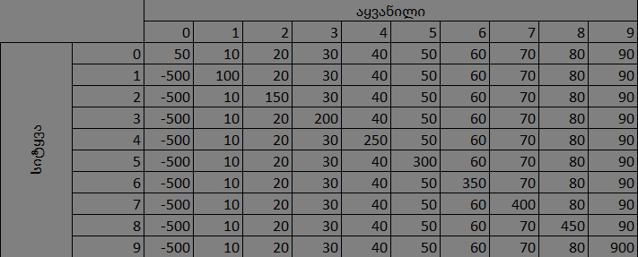

# ჯოკერი
ჯოკერი არის ბანქოს თამაში 2 დან 4 მოთამაშემდე, რომლის მიზანია საბოლოო გამარჯვებული ან გამარჯვებულები გამოავლინონ 4 გათამაშების შემდეგ.

# აღწერა
თავდაპირველად დგინდება random პრინციპით ბოლო მოთამაშე, რომელიც ამასთან ერთად კარტის დამრიგებელიც არის და მოთამაშეებს ურიგებს კარტს. ამასთან ერთად დანარჩენი მოთამაშეებიც მიმდევრობით არიან და ყოველი ახალი გათამაშების შემდეგ რიგის მიხედვით არიგებს მოთამაშე კარტებს. თითოეულ მოთამაშეს ეძლევა 9 კარტი. დასტაში ჩვენ გვაქვს 36 კარტი. 4 ფერის კარტი შემდეგი მნიშვნელობებით A, K, Q, J, 10, 9, 8, 7, 6 და კიდევ 2 Joker. ეს ჯამში 38 კარტი გამოდის სწორედ ამიტომ დასტიდან ვიღებთ 6♣-სა და 6♠-ს და ვანაცვლებთ 2 ცალი Joker-ით. კარტის დარიგების შემდეგ მიმდევრობაში პირველი მოთამაშეს ეძლევა ჯერ პრიველი 3 კარტის ნახვის საშუალება, რის შემდეგაც უნდა დაადგინოს კოზირი. კოზირის არჩევის შემდეგ კი მიმდევრობით(დაწყებული პირველი მოთამაშიდან) ყველა ამბობს იმ რიცხვს, რამდენის წაყვანასაც შეძლებენ, რა თქმა უნდა 9 ზე ნაკლები უნდა იყოს, ხოლო ბოლო მოთამაშეს ეძლევა შეზღუდვა, რაც მოიაზრებს იმას, რომ ჯამში ნათქვამი რიცხვების ჯამი არ შეიძლება იყოს 9, რადგან ერთ მოთამაშეს მაინც უნდა შეექმნას პრობლემა ქულების მხრივ. სიტყვების თქმის შემდეგ კი იწყება თამაში, რომელსაც იწყებს პირველი მოთამაშე. მას შემდეგ, რაც ყველა მოთამაშე ჩამოვა კარტს უმაღლესი კარტის ავტორი უნდა დადგინდეს და გადაეცეს ეს 4 კარტი. და შემდეგზე ჩამოსვლის უფლება აქვს წინა ჩამოსვლაზე მოგებულ მოთამაშეს. ამასთან ერთად ყოველი მოთამაშე ვალდებულია რომ ჩამოვიდეს პირველი ჩამოსული კარტის ფერის კარტებს(ასეთის არსებობის შემთხვევაში) ან კოზირს თუ არსებობს, ან კიდევ Joker-ს. შენი კარტი ითვლება მაღალ კარტად თუ მოთამაშეს უჭრი კარტს იგივე ფერის კარტით. თუ მეორე მოთამაშე ჩამოვიდა კოზირს მაგ შემთხვევაში მოიგებს ის მოთამაშე, რომელიც კოზირის ფერის უმაღლეს კარტს ჩამოვა. ხოლო Joker-ი არის ყველაზე მაღალი კარტი თამაშში და შეუძლია ნებისმიერი კარტის გაჭრა, თავად Joker-ისაც კი. რაც შეეხება უკვე ქულებს ქულები ნაწილდება შემდეგნაირად:. ოთხი გათამაშების შემდეგ თუ მოთაამაშემ ყველა სიტყვა შეასრულა, მას ეძლევა პრემია, რაც გულისხმობს უმაღლესი ქულის დამატებას ოთხეულიდან და საბოლოოდ დგინდება გამარჯვებული.

## ტექნიკური იმპლემენტაცია

ყველა ძირითადი ოპერაცია გამოყოფილია ცალ-ცალკე ფუნქციებად, რაც თამაშის წესებსა და ნაბიჯებს მარტივად გასაგებსა და ლოგიკურად თანმიმდევრულს ხდის.ფუნქციები გაწერილია ისე, რომ მათი სხვა ფაილებში დაიმპორტება/გამოყენება შეიძლება. გამოყენებულია სხვადასხვა მონაცემთა სტრუქტურა: სიები, ლექსიკონები, სიმრავლე, კორტეჟი. მოდულებიდან გამოყენებულია random მოდული და მისი სხვადასხვა მეთოდი,  ამასთან ერთად time, os და turtle.

თამაშის მთელი ციკლი კონტროლდება main() ფუნქციიდან: კარტების დარიგება, მოთამაშეების ქულების დათვლა, კოზირის ფერის დადგენა, ტერმინალის გასუფთავება, ცხრილის დახატვა, სიტყვის თქმა, საბოლოო გამარჯვებულის გამოვლენა. ფუნქციონალი განაწილებულია რამდენიმე ფაულში, რაც ზრდის კოდის ორგანიზაციასა და გაუმჯობესების შანსს.

## გაშვების ინსტრუქცია
პროგრამა არის CLI ტიპის აპლიკაცია. გაშვებისთვის დაგჭირდებათ python-ის ვერსია 3.8 ან ზემოთ. ფაილის გაშვება შესაძლებელი არის ტერმინალში "Run python file" ბრძანებით. დამატებით ბიბლიოთეკები არ არის საჭირო.